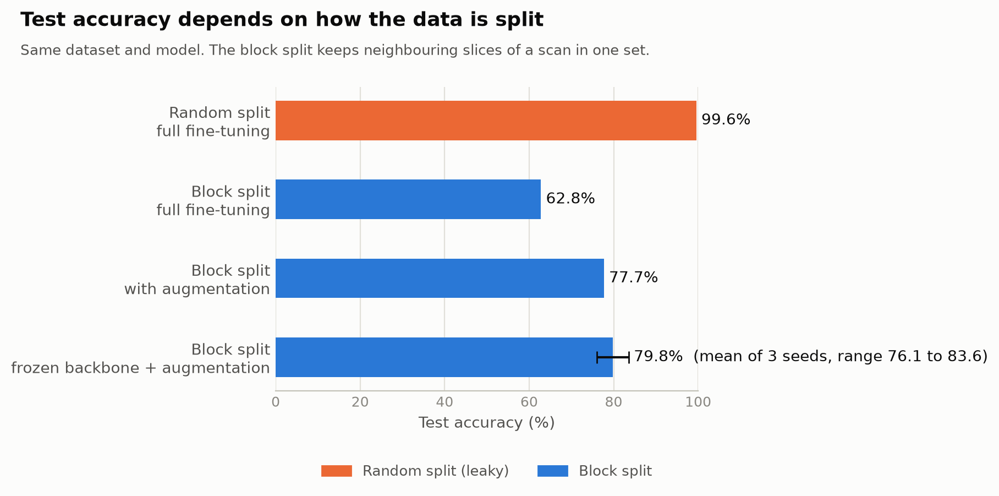

# Chest CT COVID-19 classifier: how much of 99% is real?

A slice-level classifier for chest CT scans with three classes: normal, COVID-19 positive and non-informative. The project asks one question: does the 99% accuracy reported for this dataset hold up when slices from the same scan are kept out of the test set?



## Summary

- With a random split, MobileNetV3-Large reaches **99.6%** test accuracy, reproducing the results reported for this dataset.
- With a block split that keeps neighbouring slices of a scan together, the same model drops to **62.8%**.
- Augmentation and a frozen backbone raise this to about **78% to 80%**, but the model still flags many normal slices as COVID-19 positive.

## Background

This project was inspired by [chrispathway/covid-ct-classifier](https://github.com/chrispathway/covid-ct-classifier), which reports 99.76% test accuracy with a random split per slice and notes itself that slices from the same patient can end up in both training and test data. I rebuilt the pipeline from scratch to measure how large that effect is.

## Data

[CT Scans for COVID-19 Classification](https://www.kaggle.com/datasets/azaemon/preprocessed-ct-scans-for-covid19) (Kaggle), original scans only:

- `nCT`, normal: 9,979 slices
- `pCT`, COVID-19 positive: 4,001 slices
- `NiCT`, non-informative (not enough lung visible): 5,705 slices

Findings from exploring the data (notebook 01):

- File names contain no patient or scan ID, so a patient-level split is not possible.
- Neighbouring file numbers often look nearly identical, which suggests they come from the same scan.
- Images with a round field of view and black corners make up 18.5% of `nCT` and 14.6% of `NiCT`, but only 0.3% of `pCT`. Of 2,695 such images, only 13 are positive. A model could use this as a shortcut.

## Method

1. **Split** (notebook 02). Within each class, files are sorted by number and divided into consecutive blocks: 70% train, 15% validation, 15% test. This is done separately for images with and without black corners, so every set has the same mix of image types. A random split is made for comparison. Both are saved in `splits/`.
2. **Model** (notebook 03). MobileNetV3-Large pretrained on ImageNet, with the last layer replaced by three outputs. AdamW, batch size 32, images resized to 224 x 224. The best epoch is chosen by validation loss.
3. **Experiments** (notebooks 03, 04, 06 and 07). Full fine-tuning on both splits, then augmentation (random crops, small rotations, brightness and contrast changes) and a frozen backbone on the block split. The frozen setup was trained with three seeds.
4. **Explainability** (notebook 05). Grad-CAM heatmaps show which image regions drive the "positive" prediction.
5. **Final evaluation** (notebook 08). The final configuration was fixed before this step. Every model was evaluated once on its test set.

## Results on the test set

- Random split, full fine-tuning: **99.56%**. Normal slices flagged as positive: 0.
- Block split, full fine-tuning: **62.78%**. Normal slices flagged as positive: 945 of 1,498.
- Block split, with augmentation: **77.69%**. Normal slices flagged as positive: 411.
- Block split, frozen backbone with augmentation: **79.79%** on average over three seeds (76.06%, 79.75%, 83.57%). Normal slices flagged as positive: 418 on average. The model finds 92% of positive slices, but only 56% of its positive predictions are correct.

The gap between augmentation alone and augmentation with a frozen backbone is within the spread between seeds, so these results do not show that freezing adds much on top of augmentation.

## What Grad-CAM showed

- For correctly detected positive slices, the heatmaps lie on the hazy lung areas typical of COVID-19.
- For normal slices predicted as positive, the heatmaps also lie mostly in the lungs, especially the back of the lungs, but in four of six examples also on the scanner table below the patient. The model partly relies on features of how a scan was made rather than on the disease.

## Limitations

- Without patient IDs, the block split reduces leakage but cannot rule it out completely.
- Validation and test scores differ by several points, so results depend on which block of scans is evaluated.
- The baseline and augmentation-only models were trained with one seed.
- All data comes from two hospitals in Wuhan, and the model has not been tested on data from elsewhere.
- The model classifies single slices. A clinical assessment looks at the full scan, symptoms and lab results.

**This is a learning project. It is not a medical device and must not be used to make decisions about anyone's health.**

## Repository structure

```
.
├── notebooks/
│   ├── 01_exploration.ipynb        Data exploration
│   ├── 02_split.ipynb              Block split and random split
│   ├── 03_training.ipynb           Full fine-tuning on the block split
│   ├── 04_random_split.ipynb       Full fine-tuning on the random split
│   ├── 05_gradcam.ipynb            Grad-CAM analysis
│   ├── 06_augmentation.ipynb       Block split with augmentation
│   ├── 07_frozen_backbone.ipynb    Frozen backbone, three seeds
│   └── 08_test_evaluation.ipynb    Final evaluation on the test set
├── splits/                         The two splits as CSV files
├── assets/                         Figures used in this README
└── requirements.txt
```

The trained models are not included in the repository.

## How to run

1. Install Python 3.12 and create a virtual environment.
2. Install PyTorch from [pytorch.org](https://pytorch.org), choosing the CUDA build for your GPU. This project used an NVIDIA RTX 5060, which needs a build for CUDA 12.8 or newer.
3. Install the other packages: `pip install -r requirements.txt`
4. Download the dataset from Kaggle and place the original scans in `data/Original CT Scans/`, with the folders `nCT`, `NiCT` and `pCT`.
5. Run the notebooks in order. Each training notebook takes roughly 10 to 30 minutes on an RTX 5060.

## Acknowledgements

- Dataset: [CT Scans for COVID-19 Classification](https://www.kaggle.com/datasets/azaemon/preprocessed-ct-scans-for-covid19) by Abu Zahid Bin Aziz, licensed under CC BY 4.0. The original images are from the [iCTCF](http://ictcf.biocuckoo.cn/) resource: Ning, W. et al., "iCTCF: an integrative resource of chest computed tomography images and clinical features of patients with COVID-19 pneumonia" (2020).
- Inspiration: [chrispathway/covid-ct-classifier](https://github.com/chrispathway/covid-ct-classifier).
- Model: Howard, A. et al., ["Searching for MobileNetV3"](https://arxiv.org/abs/1905.02244), ICCV 2019.
- Grad-CAM: Selvaraju, R. R. et al., ["Grad-CAM: Visual Explanations from Deep Networks via Gradient-based Localization"](https://arxiv.org/abs/1610.02391), ICCV 2017, using the [pytorch-grad-cam](https://github.com/jacobgil/pytorch-grad-cam) library.
- On data leakage from slice-level splits: Yagis, E. et al., ["Effect of data leakage in brain MRI classification using 2D convolutional neural networks"](https://www.nature.com/articles/s41598-021-01681-w), Scientific Reports, 2021.